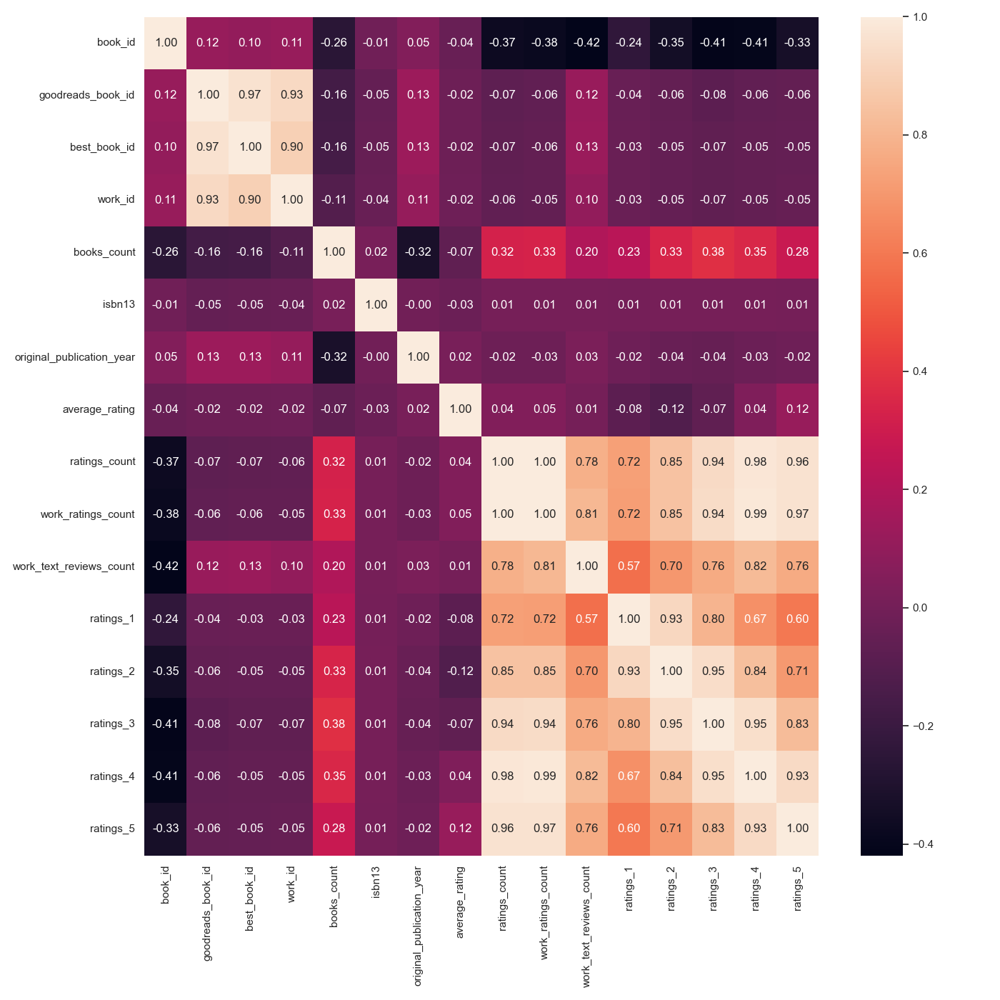
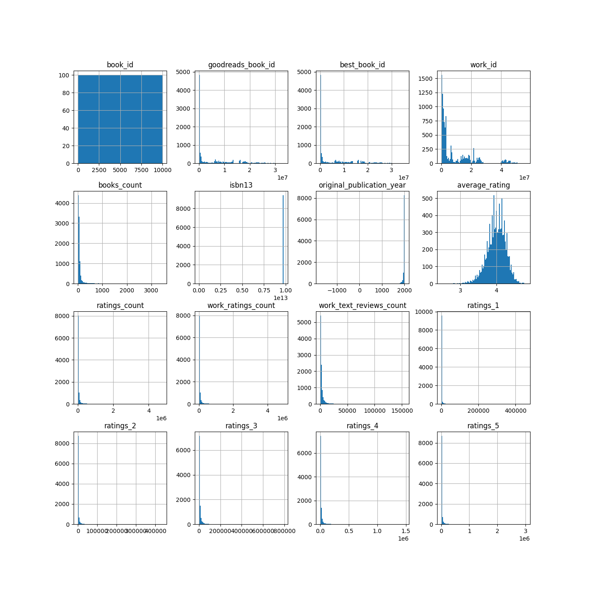
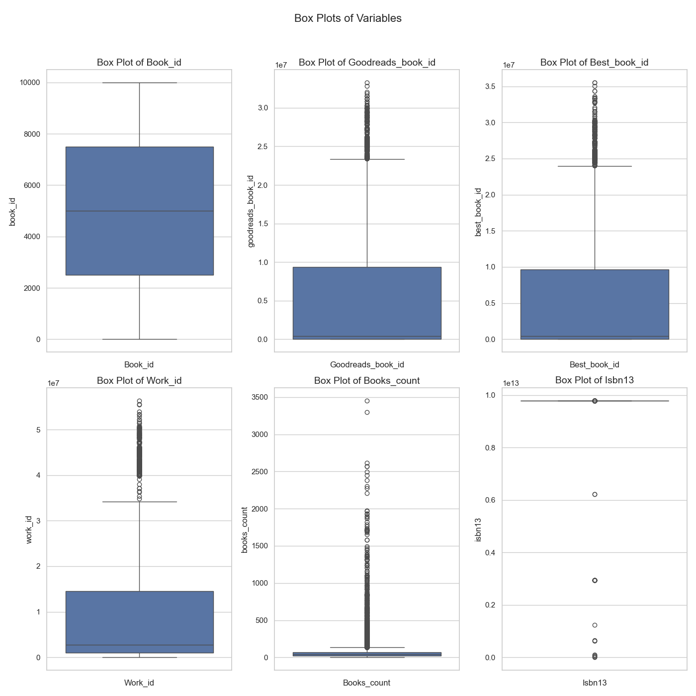

# Data Analysis Project 
Welcome to the data analysis project! Here's an overview of your dataset:

## Domain
Your data relates to **Books**.

## Key Statistics
|       |   book_id |   goodreads_book_id |     best_book_id |         work_id |   books_count |         isbn13 |   original_publication_year |   average_rating |    ratings_count |   work_ratings_count |   work_text_reviews_count |   ratings_1 |   ratings_2 |   ratings_3 |      ratings_4 |       ratings_5 |
|:------|----------:|--------------------:|-----------------:|----------------:|--------------:|---------------:|----------------------------:|-----------------:|-----------------:|---------------------:|--------------------------:|------------:|------------:|------------:|---------------:|----------------:|
| count |     10000 |     10000           |  10000           | 10000           |         10000 | 9415           |                        9979 |            10000 |  10000           |      10000           |                     10000 |       10000 |       10000 |       10000 | 10000          | 10000           |
| mean  |      5000 |         5.2647e+06  |      5.47121e+06 |     8.64618e+06 |            75 |    9.75504e+12 |                        1981 |                4 |  54001           |      59687           |                      2919 |        1345 |        3110 |       11475 | 19965          | 23789           |
| std   |      2886 |         7.57546e+06 |      7.82733e+06 |     1.17511e+07 |           170 |    4.42862e+11 |                         152 |                0 | 157369           |     167803           |                      6124 |        6635 |        9717 |       28546 | 51447          | 79768           |
| min   |         1 |         1           |      1           |    87           |             1 |    1.9517e+08  |                       -1750 |                2 |   2716           |       5510           |                         3 |          11 |          30 |         323 |   750          |   754           |
| 25%   |      2500 |     46275           |  47911           |     1.00884e+06 |            23 |    9.78032e+12 |                        1990 |                3 |  13568           |      15438           |                       694 |         196 |         656 |        3112 |  5405          |  5334           |
| 50%   |      5000 |    394965           | 425123           |     2.71952e+06 |            40 |    9.78045e+12 |                        2004 |                4 |  21155           |      23832           |                      1402 |         391 |        1163 |        4894 |  8269          |  8836           |
| 75%   |      7500 |         9.38222e+06 |      9.63611e+06 |     1.45177e+07 |            67 |    9.78083e+12 |                        2011 |                4 |  41053           |      45915           |                      2744 |         885 |        2353 |        9287 | 16023          | 17304           |
| max   |     10000 |         3.32886e+07 |      3.55342e+07 |     5.63996e+07 |          3455 |    9.79001e+12 |                        2017 |                4 |      4.78065e+06 |          4.94236e+06 |                    155254 |      456191 |      436802 |      793319 |     1.4813e+06 |     3.01154e+06 |

## Visualizations
### Correlation Heatmap

To analyze a correlation heatmap, you typically look for relationships between the variables indicated. Here's how to interpret it generally:

1. **Values**: The values in each cell range from -1 to 1.
   - A value close to 1 indicates a strong positive correlation (as one variable increases, so does the other).
   - A value close to -1 indicates a strong negative correlation (as one variable increases, the other decreases).
   - A value around 0 suggests no correlation.

2. **Key Relationships**:
   - **High Positive Correlations**: Look for cells with values above 0.5. These pairs of variables are likely to increase together.
   - **High Negative Correlations**: Look for cells with values below -0.5. These pairs move in opposite directions.
   - **Low or No Correlation**: Values between -0.3 and 0.3 suggest weak or no relationship.

3. **Variable Groups**: It can be useful to categorize variables. For instance, grouping ratings, publication years, etc., to see relationships within categories.

4. **Outlier Behavior**: Identify any variables that show unusual patterns or correlations that might warrant further investigation.

5. **Inferential Insights**: Use these correlations to inform decisions or further analyses. For instance, if `average_rating` shows a strong correlation with another metric, you may prioritize that metric in a recommendation system or analysis.

6. **Visual Interpretation**: Darker colors typically represent stronger correlations. This visual cue can help quickly identify which relationships are most significant.

If you have specific questions about certain variables or aspects of the heatmap you'd like to delve into, feel free to ask!

### Histograms

Once upon a time in the vibrant land of data, we embarked on a journey through the world of histograms, where each graph told a unique tale. 

As we started, we encountered the **book_id** histogram. A few scattered entries hinted at its sparse magic, suggesting some books were more elusive than others. Next to it, the **goodreads_book_id** revealed a similar story, where numerous books seemed to blend into the background, leaving only a few shining bright.

Venturing onward, we found the **best_book_id**. Here, peaks rose dramatically as popular stories captured the hearts of readers, showing a clear preference for some tales over others. It seemed the community had spoken!

The **work_id** histogram looked like a grand mountain range, brimming with life—countless works celebrated by avid readers. This was a landscape of literary diversity, each peak depicting a beloved creation.

As we turned to the **books_count**, we were greeted by a steady rise, portraying a journey through a library’s worth of literature. The **isbn13** histogram captured a moment of clarity, displaying a confluence of identifiers where some numbers stood alone while others danced in harmony.

In the realm of time, the **original_publication_year** timeline showcased a beautiful spectrum, with tales from bygone eras mingling with contemporary favorites, hinting at how stories aged like fine wine.

The excitement built up as we faced the **average_rating** histogram. A majestic hill appeared, illustrating the deep love readers had for certain stories, with a few outliers that sparked curiosity.

Next, the **ratings_count** histogram told of the stories that had ignited discussions, revealing how some books garnered massive followings while others remained in the shadows waiting to be discovered.

As we neared the end of our expedition, we encountered the **work_ratings** and **work_text_reviews**. Both were bustling marketplaces of opinions—here, stories got their voices, reflecting varied sentiments and experiences shared by readers across time and space.

Finally, we reached the **ratings_1** through **ratings_5** histograms. These were captivating tales of love and loathing, where readers expressed their feelings in a spectrum that ranged from the deepest adoration to the occasional disappointment.

As the sun began to set on our histogram journey, we realized that each graph, a facet of a grander narrative, paints a rich picture of the literary universe—a universe governed by readers’ emotions and choices, forever evolving and inviting new explorers. And so, our adventure through the land of histograms concluded, leaving us enriched and eager for the tales yet to be uncovered.

### Box Plots

To analyze the box plots you provided, I'll discuss the key features and insights they typically convey:

1. **Box Plot Structure**: Each box plot displays the distribution of a dataset. It includes the median (line inside the box), quartiles (the edges of the box), and potential outliers (points outside the "whiskers").

2. **Interpreting Each Plot**:
   - **Book_id (Top Left)**: This plot may show a wide range of values. The presence of outliers suggests some book IDs are significantly higher or lower than the norm.
   
   - **Goodreads_book_id (Top Middle)**: Similar observations regarding the spread of the data. The concentration of values around certain regions might hint at frequently found IDs.
   
   - **Best_book_id (Top Right)**: This plot indicates how the best book IDs are distributed. Any outliers may represent exceptionally high ratings or review counts.

   - **Work_id (Bottom Left)**: The distribution could show how work IDs are spread out. A narrower box suggests less variability in work IDs.

   - **Books_count (Bottom Middle)**: High variability is indicated by the size of the box and presence of outliers, suggesting significant differences in the number of books attributed to each ID.

   - **Isbn13 (Bottom Right)**: This plot may reflect a tighter range of ISBNs, but any outliers may indicate rare or special edition identifiers.

3. **Common Insights**:
   - The presence of outliers across several plots indicates variability and could prompt further investigation into why some data points are significantly different.
   - The spread (IQR) is useful for identifying consistency in data. Wider boxes signify more diversity in the dataset.

4. **Next Steps**:
   - It would be valuable to look into the outliers to assess whether they denote errors, unique cases, or indicate data that could be worth a closer look.
   - Consider checking correlations between variables to draw more contextualized insights.

If you have specific questions about a particular plot or variable, feel free to ask!
