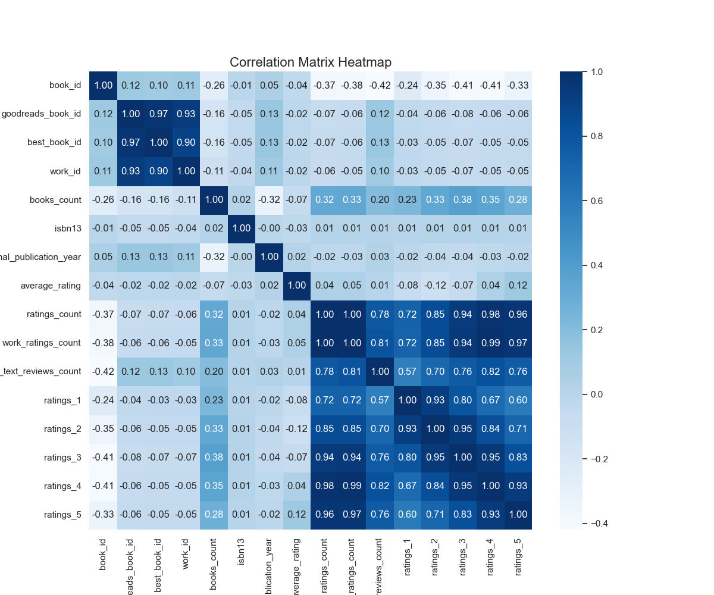
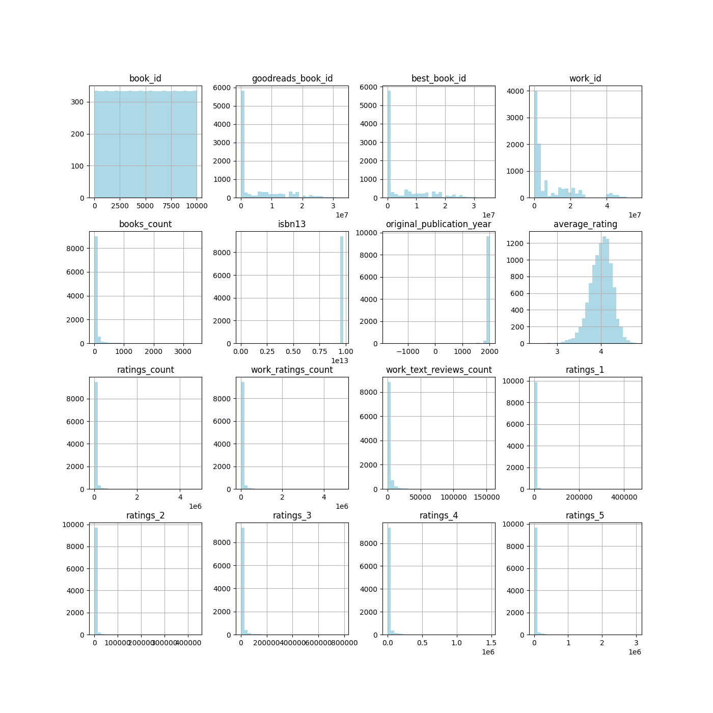
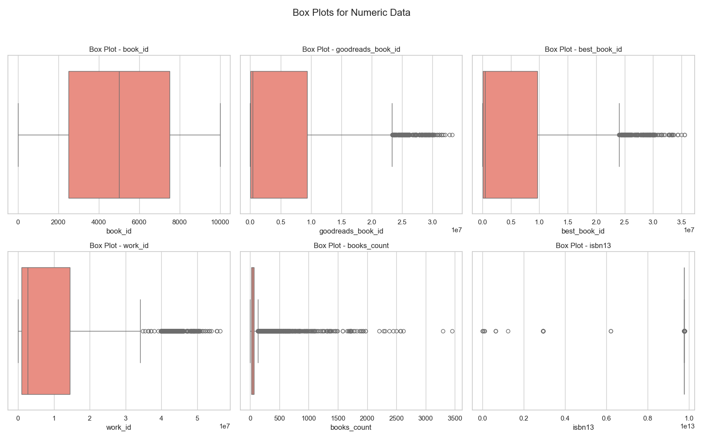

# Data Analysis Summary

## Dataset Overview
The dataset appears to pertain to the domain of **No response** based on the column names provided.

### Summary Statistics
|       |   book_id |   goodreads_book_id |     best_book_id |         work_id |   books_count |         isbn13 |   original_publication_year |   average_rating |    ratings_count |   work_ratings_count |   work_text_reviews_count |   ratings_1 |   ratings_2 |   ratings_3 |      ratings_4 |       ratings_5 |
|:------|----------:|--------------------:|-----------------:|----------------:|--------------:|---------------:|----------------------------:|-----------------:|-----------------:|---------------------:|--------------------------:|------------:|------------:|------------:|---------------:|----------------:|
| count |  10000    |     10000           |  10000           | 10000           |      10000    | 9415           |                     9979    |         10000    |  10000           |      10000           |                  10000    |    10000    |    10000    |     10000   | 10000          | 10000           |
| mean  |   5000.5  |         5.2647e+06  |      5.47121e+06 |     8.64618e+06 |         75.71 |    9.75504e+12 |                     1981.99 |             4    |  54001.2         |      59687.3         |                   2919.96 |     1345.04 |     3110.88 |     11475.9 | 19965.7        | 23789.8         |
| std   |   2886.9  |         7.57546e+06 |      7.82733e+06 |     1.17511e+07 |        170.47 |    4.42862e+11 |                      152.58 |             0.25 | 157370           |     167804           |                   6124.38 |     6635.63 |     9717.12 |     28546.5 | 51447.4        | 79768.9         |
| min   |      1    |         1           |      1           |    87           |          1    |    1.9517e+08  |                    -1750    |             2.47 |   2716           |       5510           |                      3    |       11    |       30    |       323   |   750          |   754           |
| 25%   |   2500.75 |     46275.8         |  47911.8         |     1.00884e+06 |         23    |    9.78032e+12 |                     1990    |             3.85 |  13568.8         |      15438.8         |                    694    |      196    |      656    |      3112   |  5405.75       |  5334           |
| 50%   |   5000.5  |    394966           | 425124           |     2.71952e+06 |         40    |    9.78045e+12 |                     2004    |             4.02 |  21155.5         |      23832.5         |                   1402    |      391    |     1163    |      4894   |  8269.5        |  8836           |
| 75%   |   7500.25 |         9.38223e+06 |      9.63611e+06 |     1.45177e+07 |         67    |    9.78083e+12 |                     2011    |             4.18 |  41053.5         |      45915           |                   2744.25 |      885    |     2353.25 |      9287   | 16023.5        | 17304.5         |
| max   |  10000    |         3.32886e+07 |      3.55342e+07 |     5.63996e+07 |       3455    |    9.79001e+12 |                     2017    |             4.82 |      4.78065e+06 |          4.94236e+06 |                 155254    |   456191    |   436802    |    793319   |     1.4813e+06 |     3.01154e+06 |

---

## Visualizations and Observations

### 1. Correlation Heatmap

**Analysis:**
No response

### 2. Histograms

**Analysis:**
No response

### 3. Box Plots

**Analysis:**
No response

Thank you for exploring this analysis!
