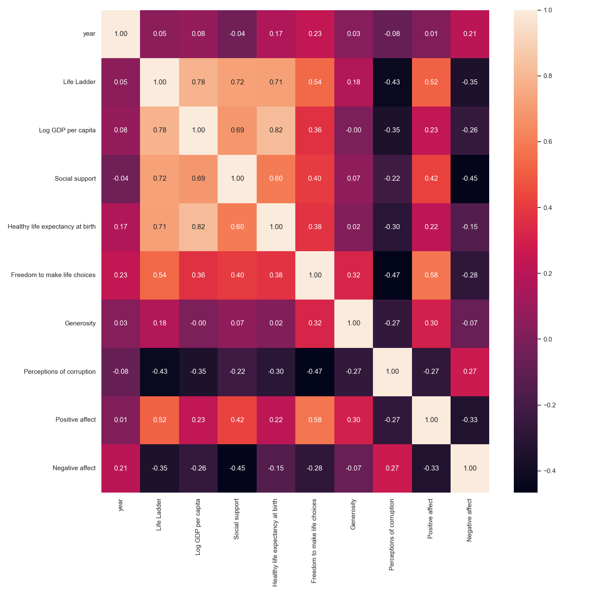
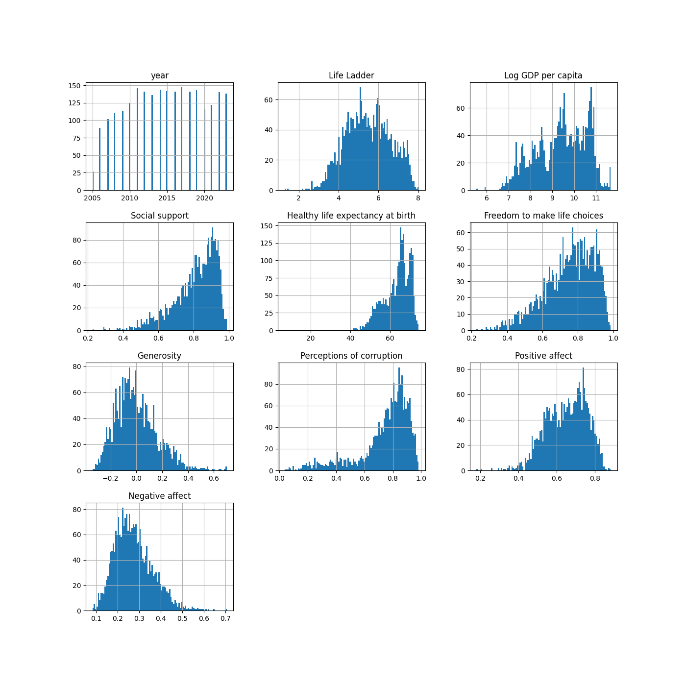
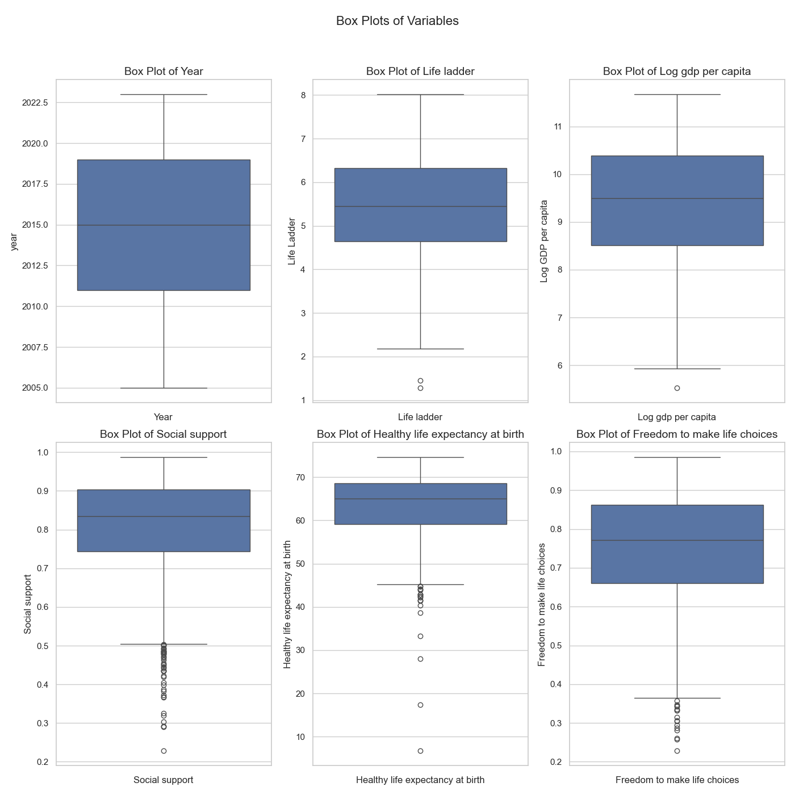

# Data Analysis Project 
Welcome to the data analysis project! Here's an overview of your dataset:

## Domain
Your data relates to **Happiness**.

## Key Statistics
|       |   year |   Life Ladder |   Log GDP per capita |   Social support |   Healthy life expectancy at birth |   Freedom to make life choices |   Generosity |   Perceptions of corruption |   Positive affect |   Negative affect |
|:------|-------:|--------------:|---------------------:|-----------------:|-----------------------------------:|-------------------------------:|-------------:|----------------------------:|------------------:|------------------:|
| count |   2363 |          2363 |                 2335 |             2350 |                               2300 |                           2327 |         2282 |                        2238 |              2339 |              2347 |
| mean  |   2014 |             5 |                    9 |                0 |                                 63 |                              0 |            0 |                           0 |                 0 |                 0 |
| std   |      5 |             1 |                    1 |                0 |                                  6 |                              0 |            0 |                           0 |                 0 |                 0 |
| min   |   2005 |             1 |                    5 |                0 |                                  6 |                              0 |            0 |                           0 |                 0 |                 0 |
| 25%   |   2011 |             4 |                    8 |                0 |                                 59 |                              0 |            0 |                           0 |                 0 |                 0 |
| 50%   |   2015 |             5 |                    9 |                0 |                                 65 |                              0 |            0 |                           0 |                 0 |                 0 |
| 75%   |   2019 |             6 |                   10 |                0 |                                 68 |                              0 |            0 |                           0 |                 0 |                 0 |
| max   |   2023 |             8 |                   11 |                0 |                                 74 |                              0 |            0 |                           0 |                 0 |                 0 |

## Visualizations
### Correlation Heatmap

To analyze the correlation heatmap you've provided, here are some key points to consider:

1. **Correlation Coefficients**: The values range from -1 to 1, where:
   - **1** indicates a perfect positive correlation.
   - **-1** indicates a perfect negative correlation.
   - **0** indicates no correlation.

2. **Strong Correlations**:
   - **Life Ladder and Log GDP per capita (0.72)**: This indicates a strong positive correlation, suggesting that as GDP per capita increases, the overall life satisfaction (Life Ladder) tends to increase.
   - **Social Support and Life Ladder (0.68)**: A strong positive relationship indicates that higher levels of social support are associated with higher life satisfaction.

3. **Moderate Correlations**:
   - **Healthy Life Expectancy at Birth and Life Ladder (0.44)**: This suggests a moderate positive correlation, indicating that higher life expectancy is somewhat linked to higher life satisfaction.
   - **Freedom to Make Life Choices and Life Ladder (0.63)**: Suggests that individuals who feel they have more freedom in decision-making report higher life satisfaction.

4. **Negative Correlations**:
   - **Negative Affect and Life Ladder (-0.71)**: This strong negative correlation indicates that higher negative emotions are associated with lower life satisfaction.
   - **Perception of Corruption and Life Ladder (-0.55)**: Suggests that perceptions of high corruption can negatively impact life satisfaction.

5. **Overall Trend**: Generally, the heatmap indicates that factors such as economic metrics (GDP), social support, health, and freedom are positively related to life satisfaction, while negative emotions and perceptions of corruption have a negative impact.

6. **Use of Heatmap**: This visualization serves to quickly spot important relationships between various factors that could influence life satisfaction, guiding further research or policy decisions.

By analyzing these correlations, stakeholders can identify key areas to focus on to improve overall happiness and well-being within populations.

### Histograms

Once upon a time in the land of data, a curious explorer ventured into a realm filled with histograms, each revealing tales of human experience and societal wellbeing.

**The Journey Through Time:** The explorer began at the top left, examining the "year" histogram. With each year from 2005 to 2019 depicted as tall bars, this chart narrated the steady passage of time, quietly hinting at the changes and challenges faced by the world, steadily evolving year by year.

**Climbing the Life Ladder:** Next, the traveler climbed to the "Life Ladder," a histogram that displayed how people around the world rated their overall life satisfaction. The peaks around the higher satisfaction scores whispered stories of happiness and contentment, while the valleys beckoned attention to those grappling with life's hardships.

**The Wealth of Nations:** Moving right, the explorer encountered the "Log GDP per capita" histogram. Here, a broad distribution showed some nations thriving in wealth, while others lingered in the shadows of economic struggles. Many wished for a brighter future, where prosperity would shine equally upon all.

**Connections Count:** The journey continued to "Social support," where the bars indicated how many people felt they could rely on others. High peaks revealed communities bonded through friendship and trust, while low valleys highlighted loneliness, challenging the explorer to consider the power of connection.

**The Gift of Life:** In the "Healthy life expectancy at birth" histogram, the explorer saw hopeful stories. Most bars clustered around longer life expectancies, reflecting improvements in healthcare and living conditions. However, a few lower bars served as reminders of the work still needed to ensure everyone enjoys long, healthy lives.

**Choices Matter:** The following stop was the "Freedom to make life choices" histogram. Here, the explorer discovered a balanced tableau: many felt a sense of freedom in their lives, but pockets of lost choice hinted at struggles in various corners of the globe.

**Acts of Kindness:** In a joyous section, the "Generosity" histogram showcased a spectrum of giving. High points indicated places where community spirit flourished, and many individuals stepped forward to help each other. Yet, deeper reflections were prompted by the lower bars, suggesting that sometimes generosity needs a gentle nudge.

**Trust and Transparency:** The "Perceptions of corruption" histogram told a sobering tale. With concentrations of trust at higher ratings contrasted with darker valleys, it captured the tension between faith in institutions and the specter of corruption that loomed in many lands.

**Emotions at Play:** The explorer then ventured into the realms of "Positive affect" and "Negative affect." In the former, a bright histogram showed vibrant moments of joy and happiness, echoing laughter and warmth found in daily lives. In contrast, the "Negative affect" chart depicted shadows of sorrow and worry, reminding everyone that life’s journey involves both light and dark.

As the explorer concluded this enlightening journey through the landscape of histograms, they realized that each chart, steeped in data yet rich in stories, held lessons about human connections, societal strengths, and areas needing attention. Each bar told a part of the grand narrative of life, inviting reflections and action as they returned to the world beyond the graphs.

### Box Plots

### Analysis of Box Plots

1. **Box Plot of Year**:
   - **Interquartile Range (IQR)**: The middle 50% of the data is relatively consistent, with the median staying around the mid-point of the range. The range suggests a slight increase over the years represented but should be interpreted in the context of the data’s temporal dimension.

2. **Box Plot of Life Ladder**:
   - **Median and Variation**: The median appears to center around a specific value within the range, indicating a consistent perceived quality of life. There are outliers that suggest some respondents rate their life significantly higher or lower than the majority.

3. **Box Plot of Log GDP per Capita**:
   - **Distribution**: The logarithmic scale allows for a clearer visualization of wealth distribution. The IQR indicates that while most values cluster in a particular range, there are a few outliers on the higher end, reflecting economies with much higher GDP.

4. **Box Plot of Social Support**:
   - **Central Tendency**: The median value suggests that individuals tend to feel a moderate level of social support. The presence of outliers could indicate varying perceptions of social support across different contexts or demographics.

5. **Box Plot of Healthy Life Expectancy at Birth**:
   - **Health Variability**: The median suggests a moderately high level of healthy life expectancy, but the interquartile range indicates significant variability. Outliers may reflect countries with unusually high or low healthy life expectancies.

6. **Box Plot of Freedom to Make Life Choices**:
   - **Freedom Perception**: The distribution shows that most individuals feel a reasonable degree of freedom regarding life choices. Again, the presence of outliers indicates that in certain regions, freedom is perceived very differently, either more or less favorably.

### General Observations:
- **Outliers**: Outliers in several plots suggest that there are extreme cases affecting the overall distribution. These should be investigated further to understand the underlying reasons.
- **Interquartile Ranges**: Variation in IQRs across the plots indicates differing levels of stability among the measures—some are more consistent, while others vary significantly.
- **Comparison across Plots**: It might be useful to cross-analyze these variables to see how they interrelate and influence one another, especially for health and social support metrics.

### Conclusion:
These box plots provide a solid foundation for understanding the distributions and central tendencies within the various measures. Further statistical analysis can provide insights into correlations and causations among the variables.
