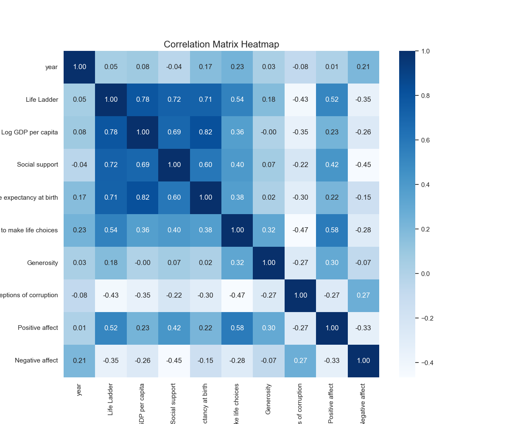
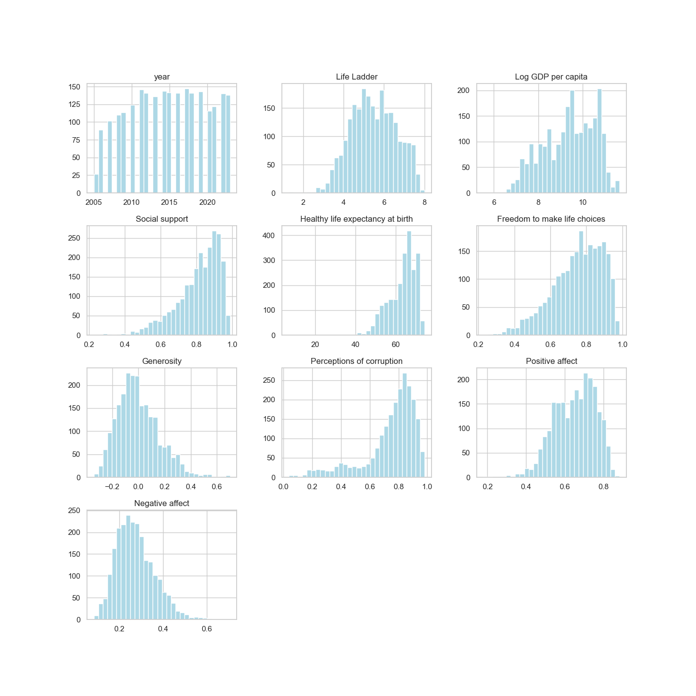
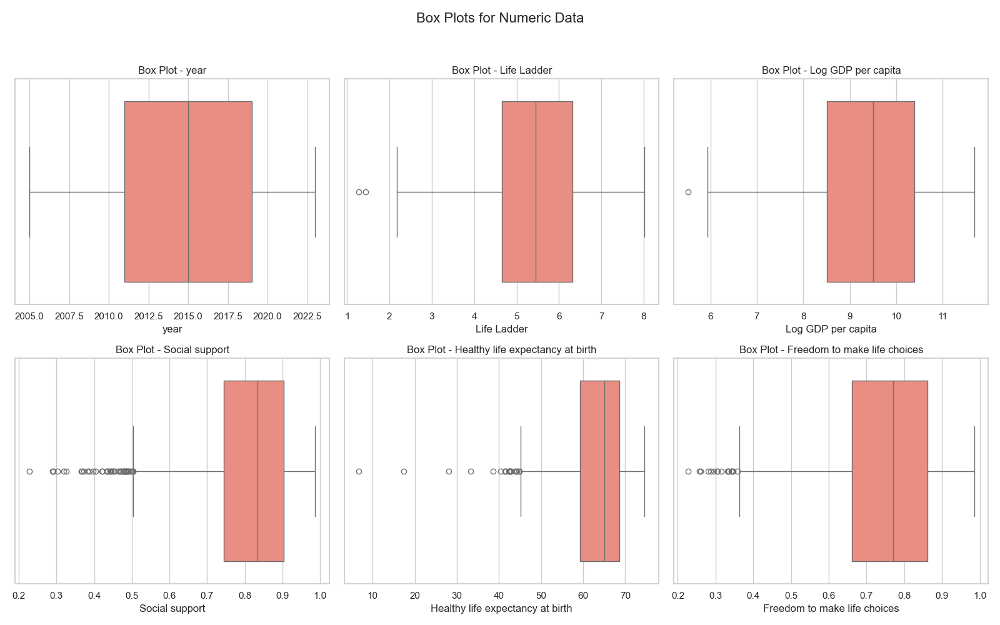

# Data Analysis Summary

## Dataset Overview
The dataset appears to pertain to the domain of **No response** based on the column names provided.

### Summary Statistics
|       |    year |   Life Ladder |   Log GDP per capita |   Social support |   Healthy life expectancy at birth |   Freedom to make life choices |   Generosity |   Perceptions of corruption |   Positive affect |   Negative affect |
|:------|--------:|--------------:|---------------------:|-----------------:|-----------------------------------:|-------------------------------:|-------------:|----------------------------:|------------------:|------------------:|
| count | 2363    |       2363    |              2335    |          2350    |                            2300    |                        2327    |      2282    |                     2238    |           2339    |           2347    |
| mean  | 2014.76 |          5.48 |                 9.4  |             0.81 |                              63.4  |                           0.75 |         0    |                        0.74 |              0.65 |              0.27 |
| std   |    5.06 |          1.13 |                 1.15 |             0.12 |                               6.84 |                           0.14 |         0.16 |                        0.18 |              0.11 |              0.09 |
| min   | 2005    |          1.28 |                 5.53 |             0.23 |                               6.72 |                           0.23 |        -0.34 |                        0.04 |              0.18 |              0.08 |
| 25%   | 2011    |          4.65 |                 8.51 |             0.74 |                              59.2  |                           0.66 |        -0.11 |                        0.69 |              0.57 |              0.21 |
| 50%   | 2015    |          5.45 |                 9.5  |             0.83 |                              65.1  |                           0.77 |        -0.02 |                        0.8  |              0.66 |              0.26 |
| 75%   | 2019    |          6.32 |                10.39 |             0.9  |                              68.55 |                           0.86 |         0.09 |                        0.87 |              0.74 |              0.33 |
| max   | 2023    |          8.02 |                11.68 |             0.99 |                              74.6  |                           0.98 |         0.7  |                        0.98 |              0.88 |              0.7  |

---

## Visualizations and Observations

### 1. Correlation Heatmap

**Analysis:**
No response

### 2. Histograms

**Analysis:**
No response

### 3. Box Plots

**Analysis:**
No response

Thank you for exploring this analysis!
