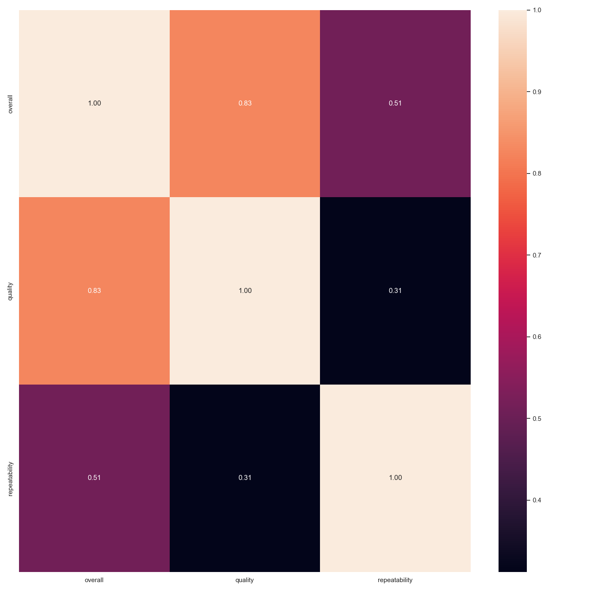
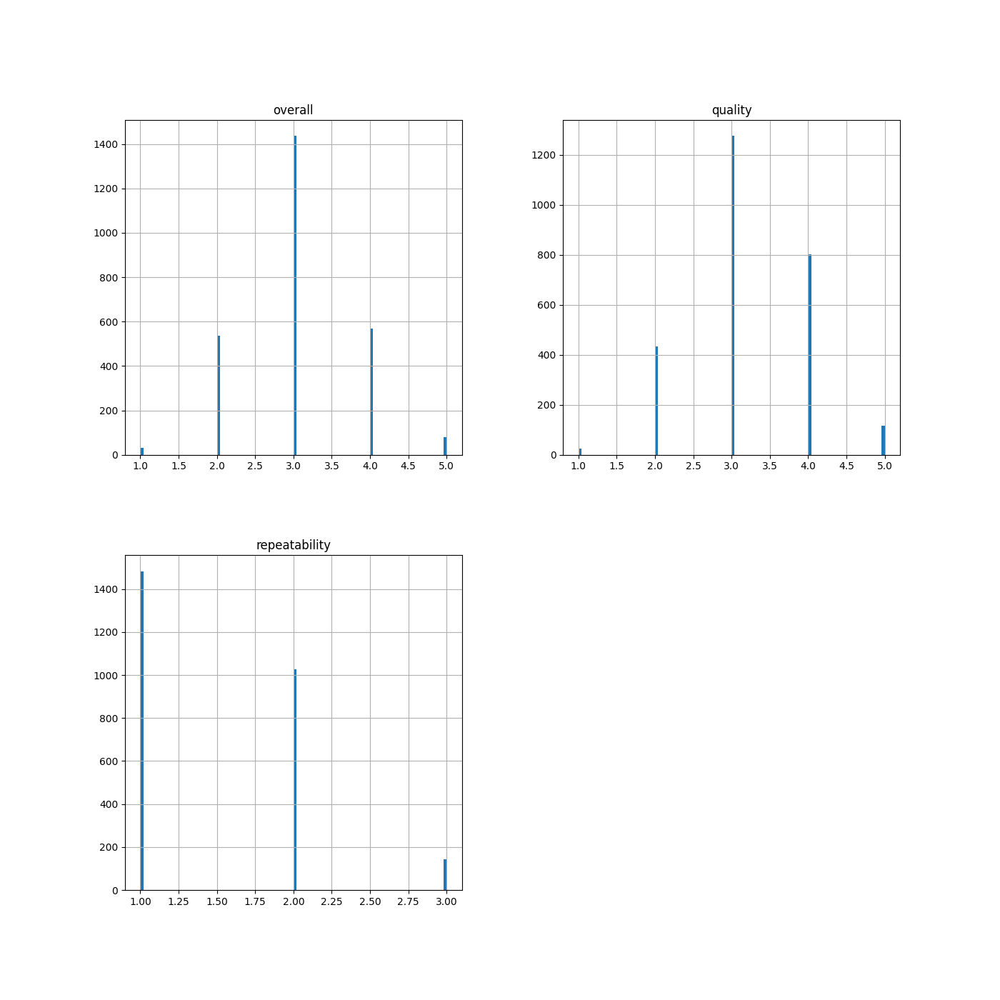
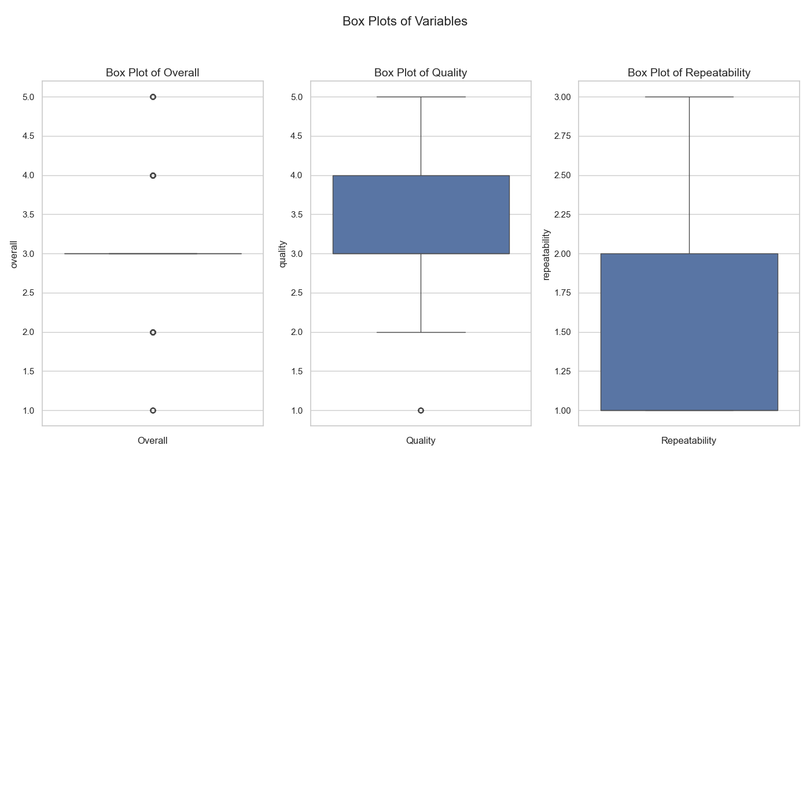

# Data Analysis Project 
Welcome to the data analysis project! Here's an overview of your dataset:

## Domain
Your data relates to **Reviews**.

## Key Statistics
|       |   overall |   quality |   repeatability |
|:------|----------:|----------:|----------------:|
| count |      2652 |      2652 |            2652 |
| mean  |         3 |         3 |               1 |
| std   |         0 |         0 |               0 |
| min   |         1 |         1 |               1 |
| 25%   |         3 |         3 |               1 |
| 50%   |         3 |         3 |               1 |
| 75%   |         3 |         4 |               2 |
| max   |         5 |         5 |               3 |

## Visualizations
### Correlation Heatmap

To analyze the correlation heatmap you've provided, let's break down the information it conveys:

1. **Correlation Values**: The values in the heatmap represent the correlation coefficients between pairs of variables:
   - 1.00 indicates a perfect positive correlation.
   - 0 indicates no correlation.
   - Negative values indicate inverse relationships.

2. **Variables**: The variables in this heatmap are:
   - **overall**
   - **quality**
   - **repeatability**

3. **Correlations**:
   - **Overall vs. Quality**: The correlation is 0.83, indicating a strong positive relationship. This suggests that as the overall score increases, the quality score tends to increase as well.
   - **Overall vs. Repeatability**: The correlation is 0.51, suggesting a moderate positive relationship. There is some association, but it's weaker compared to the overall-quality pair.
   - **Quality vs. Repeatability**: The correlation is 0.31, indicating a weak positive relationship. The association between these two metrics is the weakest among the three pairs shown.

4. **Heatmap Colors**: 
   - The color gradient helps visualize the strength of the correlations, with darker shades indicating stronger correlations. The strongest correlation (0.83) between overall and quality is represented by a bright color, while the weakest (0.31) between quality and repeatability is represented by a more subdued shade.

### Summary:
- The strongest relationship is between overall and quality.
- There is a moderate relationship between overall and repeatability.
- Quality and repeatability have a weaker correlation compared to the other pairs.

This analysis can help in understanding how these variables are interrelated, which can be useful for further analysis or decision-making processes based on this data.

### Histograms

Once upon a time in the land of Data, three distinct kingdoms thrived: Overall, Quality, and Repeatability. Each kingdom had its unique characteristics, captured vividly in their histograms.

In the **Overall** kingdom, the landscape was dominated by a towering peak at the far left, around the value of 1.5. Here, the citizens were plentiful, numbering over 1,400. However, as one moved toward the right, the population dwindled dramatically, indicating that higher values were rarely seen. This kingdom portrayed a sense of imbalance, with most of its inhabitants clustered around that low value.

Next, we journeyed to the **Quality** kingdom, where the atmosphere was somewhat similar yet distinctively more vibrant. There was a pronounced mountain at the same value of 1.5, housing more than 1,200 subjects. However, unlike Overall, Quality showed a more concentrated community, indicating that most people believed in a certain level of quality, and higher aspirations remained sparse.

Finally, we arrived at the **Repeatability** kingdom. Here, the scene shifted dramatically. Instead of a robust population spread across its land, there was a solitary spike at the far left again around 1.5, but the inhabitants were few—just shy of 200. This kingdom's histogram revealed a struggle for consistency, with only a minimal segment of the population dedicated to repeatable metrics.

As the sun set on these kingdoms, it became clear that they were interconnected. The Overall kingdom's abundance at lower values influenced Quality’s similar but slightly more vibrant existence, while Repeatability's sparse attendance raised questions and concerns about the future of summoning consistency among its people. In this realm of values, the tales of their inhabitants would continue to unfold, driven by the persistent quest for understanding and improvement. 

### Box Plots

Let's analyze the box plots presented:

1. **Box Plot of Overall:**
   - The overall distribution appears to have very little variation, as indicated by the lack of spread in the box plot. The median is around 3.5, but the interquartile range (IQR) is narrow, suggesting that most of the data points are clustered closely together. 
   - There are no outliers visible, indicating that all values fall within a similar range.

2. **Box Plot of Quality:**
   - The quality box plot shows a wider spread than the overall plot. The median is around 3.5, similar to the overall plot, but the IQR is more significant, indicating more variability among the quality values.
   - There are a few outliers indicated, suggesting that there are extreme values in the dataset that could influence analyses.

3. **Box Plot of Repeatability:**
   - The repeatability box plot has a more comprehensive range, with the median being around 2. The IQR suggests greater variability compared to the previous plots.
   - There are several outliers present, indicating that some measurements of repeatability are significantly lower than the rest of the data, potentially affecting the reliability of this measure.

### Summary:
- **Overall** shows little variability.
- **Quality** has moderate variability with some outliers.
- **Repeatability** exhibits the greatest variability among the three plots and includes several outlier observations.

This suggests that while overall performance may be consistent, quality assessments show more flexibility, and repeatability needs further investigation due to significant outliers.
